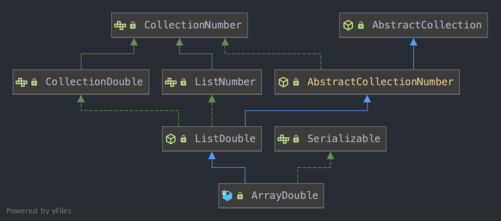

# Porting Notes
There are a total of 691 file changes/additions in this backport to JDK `1.5`.  Most of these changes are trivial changes.
All changes are detailed below.

Auth:  
George McIntyre, SLAC, 15-Feb-2021

## Configuration Changes
+ Run **Maven** with `JDK 1.8` (or `1.7`)
  + not higher - because the `target` and `source` options of the `maven-compiler-plugin` are constrained to be 7 or higher
  + not lower - because Maven `3.3.1`+ requires `JDK 1.7+`
+ Set `maven-compiler-plugin` version and other configuration with properties instead of arguments
  + set version to `3.5.1` as this is the last version allowing source and target less than `1.5`
  + set `source` and `target` to `1.5` so that we will be creating byte code `1.5` and checking source compatibility with `1.5`
+ Change version of `jca` from `2.4.7-SNAPSHOT` to `2.3.6` as this is the last byte-code compatible version

Run with the following command line:
```shell
mvn install
```

After running all tests the logs should end like this ...

```shell
[INFO] ------------------------------------------------------------------------
[INFO] Reactor Summary:
[INFO]
[INFO] EPICS Core Build ................................... SUCCESS [  1.251 s]
[INFO] org.epics.util ..................................... SUCCESS [ 13.707 s]
[INFO] pvDataJava ......................................... SUCCESS [ 15.928 s]
[INFO] normativeTypesJava ................................. SUCCESS [  4.863 s]
[INFO] pvAccessJava ....................................... SUCCESS [01:38 min]
[INFO] EPICS Core Libraries POM ........................... SUCCESS [  0.105 s]
[INFO] EPICS Core Distribution Bundle ..................... SUCCESS [  8.409 s]
[INFO] EPICS Core Nexus Deploy ............................ SUCCESS [  0.084 s]
[INFO] epics-vtype ........................................ SUCCESS [  0.037 s]
[INFO] org.epics.vtype .................................... SUCCESS [  9.007 s]
[INFO] org.epics.vtype.json ............................... SUCCESS [  3.525 s]
[INFO] org.epics.vtype.gson ............................... SUCCESS [  4.157 s]
[INFO] gpclient ........................................... SUCCESS [  0.047 s]
[INFO] org.epics.gpclient ................................. SUCCESS [ 40.924 s]
[INFO] org.epics.gpclient.sim ............................. SUCCESS [  8.023 s]
[INFO] org.epics.gpclient.ca .............................. SUCCESS [ 16.634 s]
[INFO] org.epics.gpclient.pva ............................. SUCCESS [  3.627 s]
[INFO] org.epics.gpclient.loc ............................. SUCCESS [  2.087 s]
[INFO] org.epics.gpclient.sample .......................... SUCCESS [ 12.246 s]
[INFO] ------------------------------------------------------------------------
[INFO] BUILD SUCCESS
[INFO] ------------------------------------------------------------------------
[INFO] Total time: 04:04 min
[INFO] Finished at: 2021-02-16T08:47:59-08:00
[INFO] Final Memory: 59M/402M
[INFO] ------------------------------------------------------------------------
```

## New Compatibility library in `epics-util`
Convert source to use utility classes instead of standard java classes where the `1.5` versions are incompatible with the source code.
Employed here are one of three patterns:
+ `delegate` pattern where the concrete `1.5` class is proxied for all compatible methods and new methods
are provided where missing, All implementations following the delegate patter are marked below with _delegate_.
+ `sparse` pattern implementing only methods that are referenced in these sources.  Such implementations are annotated with _sparse_ below.
+ `full` pattern implementing all methods.  All unannotated implementations listed below.

The following compatibility implementations are provided:
+ `org.epics.util.compat.jdk5`
  + `functional` - for functional programming from Java 8+
    + `Consumer`
    + `Function`
    + `Supplier`
  + `lang` - various `java.util` classes that are poorly supported in `1.5`
    + `Arrays` _delegate_
    + `Objects` _sparse_
    + `Optional`
    + `Random`
  + `net` - various classes used by the networking services that are missing some methods in `1.5`
    + `InterfaceAddress`
    + `MulticastSocket` - exists in 1.5 but does not track groups or close when socket closes
    + `NetworkInterface` _delegate_
  + `service`
    + `ServiceLoader`

## Code changes
+ `org.epics.util.array` abstract classes introduced to replace default methods on interfaces
  + `AbstractCollection` - the base class for all the abstract collections below, implementing `checkBounds()`
  + `AbstractCollectionNumber` - base for all collections of numbers, implements `toArray()`
  + `AbstractCollectionByte`, `AbstractCollectionDouble`, `AbstractCollectionFloat`, `AbstractCollectionInteger`, `AbstractCollectionLong`, `AbstractCollectionShort`, `AbstractCollectionUByte`, `AbstractCollectionUInteger`, `AbstractCollectionULong`, `AbstractCollectionUShort` - subclass reference to appropriate interface and super class
  + `IteratorByte`, `IteratorDouble`, `IteratorFloat`, `IteratorInteger`, `IteratorLong`, `IteratorNumber`, `IteratorShort`, `IteratorUByte`, `IteratorUInteger`, `IteratorULong` and `IteratorUShort` - converted from interface to abstract class to allow implementation of defaults  
  Class Diagram Example:
    
+ Use `MulticastSocket` instead of `DatagramChannel`
+ Continue to use `ByteBuffer` but whenever we do communications on the net convert to and from a `DatagramPacket`
+ Remove all `@Override` annotations from overridden implementations of interface methods
+ Use [Joda-Time](https://www.joda.org/joda-time/) instead of `java.time` classes
  + Note that Joda-Time is only accurate to the millisecond whereas java.time is accurate to the nanosecond.  
    `EPICS` expects to be accurate to the nanosecond, and many tests verify this, so we've had to change tests
    to millisecond and will have to look for a more accurate library before this can be used in production.
+ in `DefaultBeaconServerDataProvider`:`99` and `ServerRPCService`:`367` - `synchroniser` usage not supported so always `findMonitorDeadlockedThreads()`
+ in `DefaultBeaconServerDataProvider`:`105` and `ServerRPCService`:`372` -  `ManagementFactory.getOperatingSystemMXBean()` not available for Java `1.5` so default _averageSystemLoad_ to `-1` meaning
  not available
+ Use `string.trim().length() != 0` instead of `string.isEmpty()` as the `isEmpty()` method is not available to `String` in `1.5`
+ Implement methods for unsigned integer handling `toUnsignedLong()`, `toUnsignedInteger()` and `toString`
+ Convert all non-scalar `switch` / `case` statements into `if` / `else if` chains
+ Replace all unsupported diamond operators, `<>` with explicitly typed generics.  Also add them when raw types are used.
+ Replace all lambdas and method references with appropriate `new Runnable() { ... }`, `new Function() { ... }`, `new Supplier() { ... }` or `new Consumer() { ... }`

## Some extra info for macOS where you can't get JDK `1.5`
If you want to get the JDK remember that the only ones that exist are 32 bit and are therefore no longer
compatible with MacOS.  But you can do the following to get the distribution.
1. Get the DMG file from a [trusted source](http://support.apple.com/downloads/DL1359/en_US/JavaForMacOSX10.5Update10.dmg
)
2. Mount it
3. Do the following:
```shell
pkgutil --expand /Volumes/JavaformacOS2017-001/JavaForOSX.pkg ~/tmp
sed -i 's/return false/return true/g' ~/tmp/Distribution
pkgutil --flatten ~/tmp ~/Desktop/Java.pkg
rm -rf ~/tmp
```

4. Run the `Java.pkg` on your desktop
5. Unmount the dmg and delete the pkg file
```
